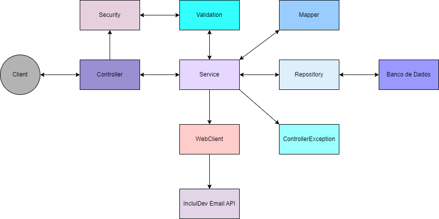
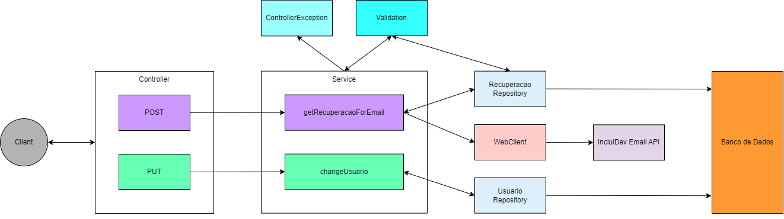
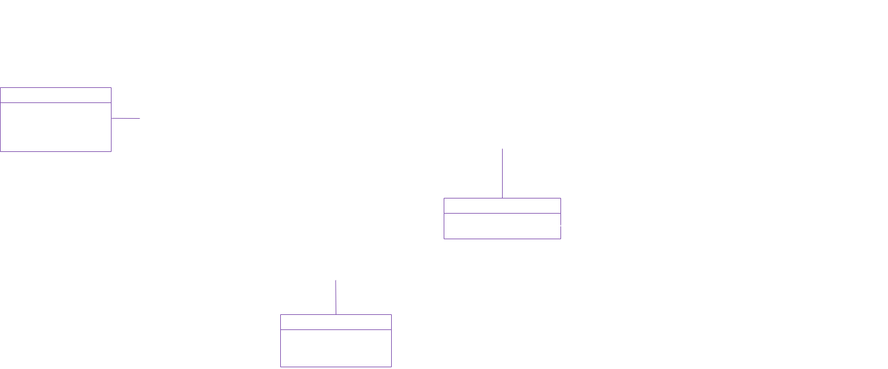

<h1 align=center>INCLUIDEV API</h1>

<div align="center">
  
</div>

#
### FUNCIONALIDADES

- Implementação de Autenticação JWT para garantia de segurança e integridade das comunicações.
- Arquitetura desacoplada e orientada a microserviços para escalabilidade e flexibilidade operacional.
- Personalização na validação e tratamento de exceções, assegurando robustez e confiabilidade no sistema.
- Persistência dinâmica de dados para adaptação eficiente às demandas variáveis do ambiente.
- Tratamento de transações com callback, garantindo consistência e integridade em operações críticas.
- Normalização de dados através de Data Objects Transactions para padronização e consistência de informações.
- Utilização do Swagger UI para uma documentação complementar detalhada e acessível.
- Estruturação de tentativas de requisições externas sob controle para manutenção da estabilidade e disponibilidade do sistema.

#
### REPRESENTAÇÃO DE FLUXO

> A representação de fluxo visa graficamente ilustrar o comportamento da aplicação em nível arquitetural, destacando os principais recursos empregados para assegurar o funcionamento eficiente do serviço.

- **Arquitetura**

<div align="center">
  
</div>

# 
- **Serviço de Recuperação de Senha**

<div align="center">
  
</div>

#
### MODELAGEM DE PERSISTÊNCIA
> Esse diagrama é uma representação técnica crucial utilizada para visualizar a estrutura e as interações dos dados persistidos no banco de dados. Ele consiste em entidades, atributos e seus relacionamentos, proporcionando uma visão clara da arquitetura subjacente do sistema de armazenamento. Esse recurso não só auxilia no entendimento da organização dos dados, mas também facilita o desenvolvimento e a manutenção de sistemas eficientes.

<div align="center">
  
</div>

#
### REQUISITOS

Para executar nossa plataforma localmente, é necessário ter em seu dispositivo computacional:

  1. Certifique-se que instalou a versão 17 do Java.  [Baixe aqui](https://www.oracle.com/java/technologies/javase/jdk17-archive-downloads.html)

  2. Certifique-se de que instalou alguma IDE em sua máquina. [Baixe aqui](https://www.jetbrains.com/idea/download/?section=windows)

#
### DOWNLOAD DO PROJETO

Baixe o projeto em seu computador através do comando:

```bash
git clone https://github.com/IncluiDev/inclui-dev-api.git
```

**ou**

1. Clique em `<> Code`.
2. Faça o download do arquivo ZIP.
3. Abra o seu explorador de arquivos na localização da instalação.
4. Extraia o arquivo ZIP.

#
### EXECUÇÃO

Sequência de execução do projeto:

1. Acesse a IDE na qual deseja executar o projeto.
2. Clique em "Abrir um projeto já existente".
3. Selecione o local da pasta descompactada do projeto.
4. Confirme a seleção.
5. Localize e clique no botão "Play" (verde) localizado na parte superior da IDE.
6. Um terminal integrado será aberto.
7. Aguarde a instalação das dependências do projeto.
8. Após a conclusão das instalações, o projeto será executado.

#
### VISUALIZAÇÃO

Abra a janela do seu navegador web padrão e acesse o seguinte endereço pela barra de pesquisa:

```bash
http://localhost:8080/swagger-ui/index.html#/
```

#
### CONTRIBUIÇÃO

1. Adicione suas mudanças ao controle de versão:

```bash
git add .
```

E aperte a tecla `Enter`

2. Comite as alterações com uma mensagem descritiva:

```bash
git commit -m "Descrição das mudanças que realizou"
```

E aperte a tecla `Enter`

3. Atualize seu repositório local com a versão mais recente do projeto:

```bash
git pull 
```

E aperte a tecla `Enter`

4. Envie suas alterações locais para o repositório remoto:

```bash
git push <remote_url> <branch_principal>
```

E aperte a tecla `Enter`

#
### EQUIPE

<table align="center">
  <tr>
    <td align="center">
      <a href="https://github.com/kaiquesouzasantos" title="Github Kaique">
        <br>
        <sub>
          <b>Kaique</b>
        </sub>
      </a>
    </td>
    <td align="center">
      <a href="https://github.com/adriele7" title="Github Adriele">
        <br>
        <sub>
          <b>Adriele</b>
        </sub>
      </a>
    </td>
    <td align="center">
      <a href="https://github.com/Kayk-Dev" title="Github Kayky">
        <br>
        <sub>
          <b>Kayk</b>
        </sub>
      </a>
    </td>
  </tr>
</table>

#
### TECNOLOGIAS

&nbsp;
&nbsp;
&nbsp;
&nbsp;
&nbsp;
&nbsp;
&nbsp;
&nbsp;

#
### DOMINIO DA API

```
http://localhost:8080
```

#
### DOCUMENTACAO DA API

```
http://localhost:8080/swagger-ui/index.html
```

<p align="center">
  
</p>
